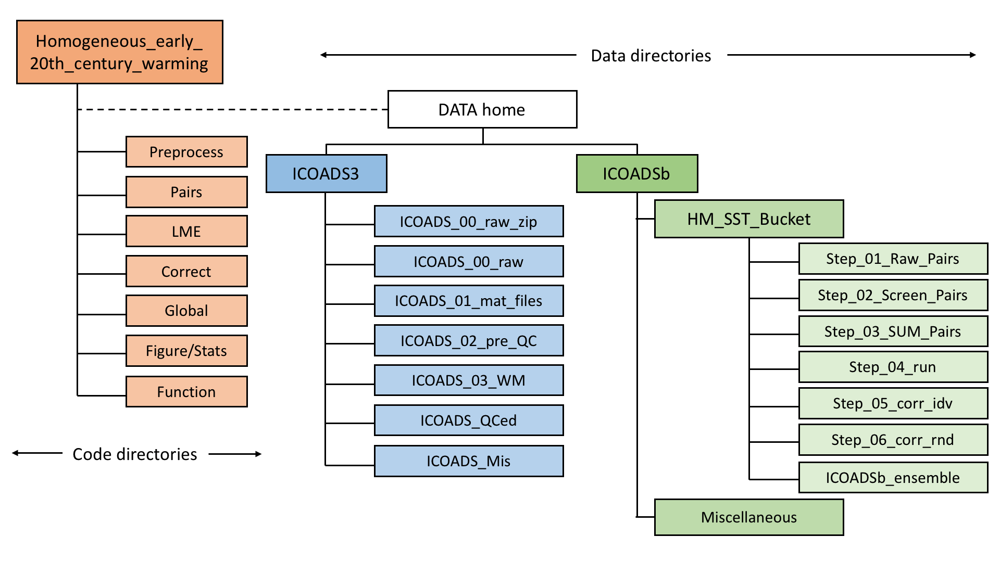
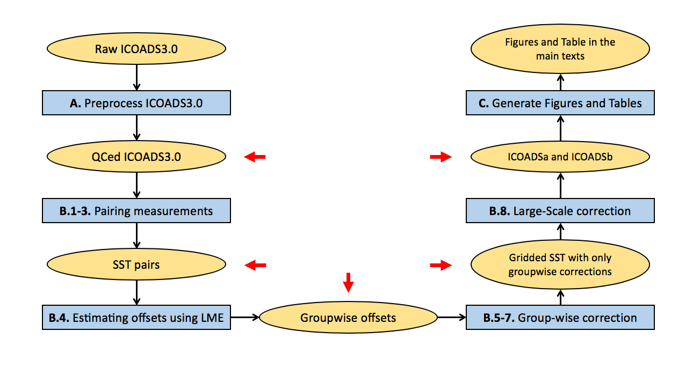

# More homogeneous early 20th century warming

<br>

Matlab and shell scripts associated with the paper "Correcting datasets leads to more homogeneous early 20th century sea surface warming " by Duo Chan, Elizabeth C. Kent, David I. Berry, and Peter Huybers.

Most of these codes are [Matlab](https://www.mathworks.com/products/matlab.html) .m files .  We provide a script [here](Quick_reproduction.m) for fast reproduction of Figures and Table in the main text.  If you are reproducing the [full analysis](#overview-and-system-requirements), which takes more computational resources and time to run, we provide two shell scripts as templates that runs the appropriate Matlab codes on clusters.  The provided shell template is for submitting jobs on the Harvard [Odyssey Cluster](https://www.rc.fas.harvard.edu/odyssey/) that uses a [SLURM workload manager](https://slurm.schedmd.com/documentation.html).    

If you have issues implementing the above scripts, or identify any deficiencies, please contact Duo Chan (duochan@g.harvard.edu).

<br>

## Get started:
Run [Chan_et_al_2019_init.m](Chan_et_al_2019_init.m) to initialize the analysis.  This script will add all codes in this package to the Matlab path and set up directories structured following the below figure.  The default path will be the directory of this package; so make sure that enough disk space is available (~3GB for simply reproducing figures and tables and ~350GB for full reproduction), or, specify another directory to store the data:

```
Chan_et_al_2019_init($DATA_home)
```



<br>

## Quick reproduction of Figures and Tables

After initialization, run [Quick_reproduction.m](Quick_reproduction.m), a wrapper that downloads [key results](https://dataverse.harvard.edu/api/access/datafile/3424404) and then generates Figs. 1-4 and Table 1, as well as the numbers reported in the main text.  The whole quick reproduction takes about 2 minutes to run on a laptop.

```
Quick_reproduction
```

Data downloaded are listed below:

* __SUM_corr_idv_HM_SST_Bucket_GC_\*.mat__: key statistics for ICOADSa and ICOADSb, which should be placed in `$DATA_home/ICOADSb/HM_SST_Bucket/`.  Key statistics include the spatial pattern of 1908-1941 trends, monthly SSTs over the North Pacific and North Atlantic, monthly SSTs near East Asia and the Eastern U.S., and PDO indices.

* __SUM_corr_rnd_HM_SST_Bucket_GC_\*.mat__: as above but for 1,000 ICOADSb correction members.

* __1908_1941_Trd_TS_and_pdo_from_all_existing_datasets_20190424.mat__: key statistics for existing major SST estimates, which should be placed in `$DATA_home/ICOADSb/Miscellaneous/`.  Major SST estimates are ERSST5, COBESST2, HadISST2, and HadSST3.  We have a copy [here]() for raw data used in our analysis.  All of these datasets are regridded to 5-degree resolution, which can be downloaded from [here]().

* __Stats_HM_SST_Bucket_deck_level_1.mat__: statistics of numbers of measurements for each nation-deck group, which should be placed in `$DATA_home/ICOADSb/HM_SST_Bucket/`.

* __LME_HM_SST_Bucket_*.mat__: groupwise offset estimates for bucket SSTs, which should be placed in `$DATA_home/ICOADSb/HM_SST_Bucket/Step_04_run/`.

* __CRUTEM.4.6.0.0.anomalies.nc__: CRUTEM4 dataset, which should be placed in `$DATA_home/ICOADSb/Miscellaneous/`.

Dependency is the __Matlab [m_map](https://www.eoas.ubc.ca/~rich/map.html) toolbox__ and we put a copy in this package.


<br>
<br>
________________________________

For users interested in reproducing our full analysis, we provide the following guidance to run the codes.

<br>

## Overview and system requirements:

Below is the flow chart of the full analysis.



Several processing steps are memory and computationally intensive.  Our analysis was run on Harvard Research Computing clusters and used 1200 CPUs and one analysis uses 150GB memory per CPU, and required 6,000 core-hours of computation and 350GB of disk space.  

To reproduce our analysis, run [get_supporting_data.m](get_supporting_data.m) to download [supporting data](https://dataverse.harvard.edu/api/access/datafile/3424402), unzip and move them to their target directories.

```
get_supporting_data
```

For purposes of facilitating reproduction we have also provided files resulting from our computation at various stages of the analysis (indicated by red arrows and see below for more details).  One can choose to start from any of these check points.  Run [get_check_points.m](get_check_points.m) to download [check points](https://dataverse.harvard.edu/api/access/datafile/3424709), unzip and move them to their target directories.

```
get_check_points
```

<br>

## A. Preprocess:
This folder contains scripts for downloading and preprocessing the ICOADS3.0 data.

Ensure that 270GB of disk space is available for raw ICOADS3.0 and outputs during preprocessing steps, and we recommend to use a cluster.  Or you can skip preprocessing by downloading the [preprocessed .mat files](https://dataverse.harvard.edu/api/access/datafile/3424401) (35GB) and place them in `$DATA_home/ICOADS3/ICOADS_QCed/`.   

__[Prerequisite]__ Ensure the following data and metadata are downloaded:

 * __ICOADS3.0__ raw data: zipped ICOADS3.0 (28GB) are from [RDA dataset 548.0](https://rda.ucar.edu/datasets/ds548.0/#!description).  Please download files to `$DATA_home/ICOADS3/ICOADS_00_raw_zip/`. We have also archived raw data we used [here](https://dataverse.harvard.edu/api/access/datafile/3424400).  After downloading, unzip files and place them in `$DATA_home/ICOADS3/ICOADS_00_raw/`.  Note that unzipped ICOADS3.0 files are 153GB in total.

The following files belong to the supporting data and should be placed in `$DATA_home/ICOADS3/ICOADS_Mis/`.

 * __OI_clim_1982_2014.mat__: 33-year [OI-SST](https://www.esrl.noaa.gov/psd/data/gridded/data.noaa.oisst.v2.highres.html) daily climatology,

 * __ERA_interim_AT2m_1985_2014_daily_climatology.mat__: 30-year [ERA-interim](https://www.ecmwf.int/en/forecasts/datasets/reanalysis-datasets/era-interim) 2m-air temperature daily climatology,

 * __Dif_DMAT_NMAT_1929_1941.mat__: mean daytime and nighttime marine air temperature difference in 1929-1941,

 * __Dif_DMAT_NMAT_1947_1956.mat__: mean daytime and nighttime marine air temperature difference in 1947-1956,

 * __Buddy_std_SST.mat__:  output from step __A.4__,

 * __Buddy_std_NMAT.mat__:  output from step __A.4__.

<br>

[Submit_preprocess.sh](Preprocess/Submit_preprocess.sh) wraps all preprocessing steps and runs scripts on the Harvard [Odyssey Cluster](https://www.rc.fas.harvard.edu/odyssey/) that uses a [SLURM workload manager](https://slurm.schedmd.com/documentation.html).  If you are using a different machinery, please make necessary changes.

To perform the preprocessing, run
```
./Preprocess/Submit_preprocess.sh
```

---

Preprocessing contains five steps, as described below.  Note that step __A.2__ follows [Chan et al., submitted]() for SST and [Kent et al. (2013)](https://agupubs.onlinelibrary.wiley.com/doi/full/10.1002/jgrd.50152) for nighttime marine air temperature, and steps __A.3-A.5__ follow [Rayner et al. (2006)](https://journals.ametsoc.org/doi/full/10.1175/JCLI3637.1) in performing buddy checking.

__A.1.__ [ICOADS_Step_01_ascii2mat.m](Preprocess/ICOADS_Step_01_ascii2mat.m)  converts ICOADS3.0 data from ASCII format to .mat files and stores them in `$DATA_home/ICOADS3/ICOADS_01_mat_files/`.

__A.2.__ [ICOADS_Step_02_pre_QC.m](Preprocess/ICOADS_Step_02_pre_QC.m) assigns missing country information and measurement method and outputs files to
`$DATA_home/ICOADS3.O/ICOADS_02_pre_QC/`.

__A.3.__ [ICOADS_Step_03_WM.m](Preprocess/ICOADS_Step_03_WM.m) computes winsorized mean of 5-day SST at 1 degree resolution.  These gridded data are stored in `$DATA_home/ICOADS3/ICOADS_03_WM/`.

__A.4.__ [ICOADS_Step_04_Neighbor_std.m](Preprocess/ICOADS_Step_04_Neighbor_std.m) computes between neighbor standard deviation of SST for each month.

__A.5.__ [ICOADS_Step_05_Buddy_check.m](Preprocess/ICOADS_Step_05_Buddy_check.m) performs buddy check and other quality controls.  Outputs are preprocessed files stored in `$DATA_home/ICOADS3/ICOADS_QCed/`.


<br>

## B. Main Code:

As shown in the [flow chart](), this step contains [pairing SST measurements](), [estimating offsets using LME](), [correcting groupwise offsets and gridding](), and [merging with common bucket corrections]().  These main steps can be accessed without preprocessing ICOADS3.0 by downloading the [preprocessed .mat files](https://dataverse.harvard.edu/api/access/datafile/3424401)(35GB) and place them in `$DATA_home/ICOADS3/ICOADS_QCed/`.  When using command lines, we suggest:

```
wget -O $target_directory/ICOADS_QCed.tar.gz  https://dataverse.harvard.edu/api/access/datafile/3424401
```

In case of use in deploying these scripts on a cluster, we provide  [Submit_main.sh](Submit_main.sh), which runs the appropriate scripts on the Harvard [Odyssey Cluster](https://www.rc.fas.harvard.edu/odyssey/) that uses a [SLURM workload manager](https://slurm.schedmd.com/documentation.html).  To run the main analysis using the shell script, simply run (the command may vary on different machineries):

```
./Submit_main.sh
```

We strongly encourage you to go through the following documentation for prerequisites of individual steps and details of the workflow.

---

__B.1-3.__ __Pairs__ folder contains functions that pair SST measurements.

  __[Prerequisite]__ Ensure that you have the following data or metadata placed in corresponding directories.

  * __IMMA1_R3.0.0_YYYY-MM_QCed.mat__: preprocessed ICOADS3.0 .mat files from running step __A.1 - A.5__.  They should be placed in `$DATA_home/ICOADS3/ICOADS_QCed/` and can be downloaded from [here](https://dataverse.harvard.edu/api/access/datafile/3424401).

  * __DA_SST_Gridded_BUOY_sum_from_grid.mat__ and __Diurnal_Shape_SST.mat__: diurnal cycle estimates based on ICOADS3.0 buoy data.  They belong to the supporting data and should be placed in `$DATA_home/ICOADSb/Miscellaneous/`.  

First, run [HM_Step_01_02_Run_Pairs_dup.m](HM_Step_01_02_Run_Pairs_dup.m) to pair SST measurements following [Chan and Huybers (2019)](https://journals.ametsoc.org/doi/pdf/10.1175/JCLI-D-18-0562.1).  This script first calls [HM_pair_01_Raw_Pairs_dup.m](Pairs/HM_pair_01_Raw_Pairs_dup.m) to pair SST measurements within 300km and 2days of one another and then calls [HM_pair_02_Screen_Pairs_dup.m](Pairs/HM_pair_02_Screen_Pairs_dup.m) to screen pairs such that each measurement is used at most once.  Output files are stored in `$DATA_home/ICOADSb/HM_SST_Bucket/Step_01_Raw_Pairs/` and `$DATA_home/ICOADSb/HM_SST_Bucket/Step_02_Screen_Pairs/`.  

Second, run [HM_Step_03_SUM_Pairs_dup.m](HM_Step_03_SUM_Pairs_dup.m) to combine screened pairs into one file, which will be used in following steps.  The combined file, __SUM_HM_SST_Bucket_Screen_Pairs_\*.mat__, is in `$DATA_home/ICOADSb/HM_SST_Bucket/Step_03_SUM_Pairs/`.  It is a check point.

---

__B.4.__ __LME__ folder contains scripts that compute offsets among nation-deck groups of SST measurements using a linear-mixed-effect model ([Chan and Huybers., 2019](https://journals.ametsoc.org/doi/pdf/10.1175/JCLI-D-18-0562.1)).  

__[Prerequisite]__ Ensure that you have the following data or metadata placed in corresponding directories.

  *  __SUM_HM_SST_Bucket_Screen_Pairs_\*.mat__: all paired measurements, which is the output of step __B.3__ and should be placed in `$DATA_home/ICOADSb/HM_SST_Bucket/Step_03_SUM_Pairs/`.  It is a check point.

  * __OI_SST_inter_annual_decorrelation_20180316.mat__: SST covariance structures estimated from the 33-year [OI-SST](https://www.esrl.noaa.gov/psd/data/gridded/data.noaa.oisst.v2.highres.html) dataset.  It is one of the supporting data and should be placed in `$DATA_home/ICOADSb/Miscellaneous/`.  

Run [HM_Step_04_LME_cor_err_dup.m](HM_Step_04_LME_cor_err_dup.m) to perform offset estimation.  This script first calls [HM_lme_bin_dup.m](LME/HM_lme_bin_dup.m) to aggregate SST pairs according to combinations of groupings, years, and regions, which reduces the number of SST differences from 17.8 million to 71,973.  This step will output __BINNED_HM_SST_Bucket_\*.mat__ to directory `$DATA_home/ICOADSb/HM_SST_Bucket/Step_04_run/`.

[HM_Step_04_LME_cor_err_dup.m](HM_Step_04_LME_cor_err_dup.m) then calls [HM_lme_fit_hierarchy.m](LME/HM_lme_fit_hierarchy.m) to fit the LME regression model and output groupwise offset estimates.  The output file, __LME_HM_SST_Bucket_\*.mat__, is a check point and will also be placed in `$DATA_home/ICOADSb/HM_SST_Bucket/Step_04_run/`.  Note that fitting the LME model involves inversion of a big matrix (~70,000 x 70,000) and takes 150GB of memory to run.

---

__B.5-7.__ __Correct__ folder contains scripts that apply groupwise corrections and generates 5x5-degree gridded SST estimates.  Groupwise corrections are applied to each SST measurement by removing offset estimated in step __B.4__ according to group, year, and region.   

__[Prerequisite]__ Ensure that you have the following data or metadata placed in corresponding directories.

  * __IMMA1_R3.0.0_YYYY-MM_QCed.mat__: preprocessed ICOADS3.0 .mat files from running step __A.1 - A.5__.  They should be placed in `$DATA_home/ICOADS3/ICOADS_QCed/` and can be downloaded from [here](https://dataverse.harvard.edu/api/access/datafile/3424401).

  * __LME_HM_SST_Bucket_\*.mat__: groupwise offset estimates using an LME method, which is the output of step __B.4__ and should be placed in `$DATA_home/ICOADSb/HM_SST_Bucket/Step_04_run/`.  It is a check point.

  * __internal_climate_patterns.mat__: spatial pattern of PDO in SST.  It is one of the supporting data and should be placed in `$DATA_home/ICOADSb/Miscellaneous/`.

  * __nansum.m__: a function that computes summation but returns NaN when all inputs are NaNs.  The default Matlab [nansum.m](https://www.mathworks.com/help/stats/nansum.html)(release 2018b) function returns zero when all entries are NaNs.  Our [nansum.m](Function/nansum.m) is in `$home_Code/Function/`.

First, run [HM_Step_05_Corr_Idv.m](HM_Step_05_Corr_Idv.m) to perform corrections using the maximum likelihood estimates of offsets and generate gridded SST estimates.  [HM_Step_05_Corr_Idv.m](HM_Step_05_Corr_Idv.m) also generates gridded SST estimates that correct for only one group at a time.  This step generates SST datasets that only have groupwise corrections, i.e., __corr_idv_HM_SST_Bucket_\*.mat__ in `$DATA_home/ICOADSb/HM_SST_Bucket/Step_05_corr_idv/`.

Then, run [HM_Step_06_Corr_Rnd.m](HM_Step_06_Corr_Rnd.m) to generate a 1000-member ensemble of gridded SSTs, which can be used to estimate uncertainties of groupwise corrections.  Corrections offsets are drawn from a multivariate normal distribution that centers on the maximum likelihood estimate (see appendix in [Chan and Huybers., 2019](https://journals.ametsoc.org/doi/pdf/10.1175/JCLI-D-18-0562.1)).   This step generates SST datasets that only have randomized groupwise corrections, i.e., __corr_rnd_HM_SST_Bucket_\*.mat__ in `$DATA_home/ICOADSb/HM_SST_Bucket/Step_06_corr_rnd/`.

Finally, run [HM_Step_07_SUM_Corr.m](HM_Step_07_SUM_Corr.m) to compute statistics of gridded SST estimates.  These statistics include the spatial pattern of 1908-1941 trends, monthly SSTs over the North Pacific and North Atlantic, monthly SSTs near East Asia and the Eastern U.S., and PDO indices.  This step will output __SUM_corr_idv_HM_SST_Bucket_\*.mat__ (central estimates) and __SUM_corr_rnd_HM_SST_Bucket_*.mat__ (uncertainty estimates) in `$DATA_home/ICOADSb/HM_SST_Bucket/`.  The two files are downloaded as check points.

---

__B.8.__ __Global__ folder contains scripts that merge large-scale common bucket corrections to raw ICOADS3.0 and ICOADS3.0 with groupwise corrections.  The resulting datasets are called ICOADSa and ICOADSb, respectively.  

__[Prerequisite]__ Ensure that you have the following data or metadata placed in corresponding directories.

  * __corr_idv_HM_SST_Bucket_\*_en_0_\*.mat__: SST with only groupwise corrections using maximum likelihood estimates of offsets, which is an output from step __B.5__ and should be placed in `$DATA_home/ICOADSb/HM_SST_Bucket/Step_05_corr_idv/`.  It is a check point.

  * __SUM_corr_rnd_HM_SST_Bucket_\*.mat__ and __SUM_corr_idv_HM_SST_Bucket_\*.mat__: key statistics of SST with only groupwise corrections, which are outputs from step __B.6__ and should be placed in `$DATA_home/ICOADSb/HM_SST_Bucket/`.  The two files are downloaded as check points.

  * __Global_Bucket_Correction_start_ratio_35_mass_small_0.65_mass_large_1.7_start_ratio_35.mat__: our reproduced 1850-2014 common bucket bias correction.  The reproduction follows [Kennedy et al., (2012)](https://agupubs.onlinelibrary.wiley.com/doi/abs/10.1029/2010jd015220) and details can be found in Extended Data Fig.8 and Supplemental Information Table 3 in Chan et al., submitted.  These corrections involve running two bucket models, which can be accessed from [here](https://github.com/duochanatharvard/SST_Bucket_Model).  Common bucket correction is a one of the supporting data and should be placed in `$DATA_home/ICOADSb/Miscellaneous/`.

Following files are results of existing major SST estimates, i.e.,  ERSST5, COBESST2, HadISST2, and HadSST3.  These files belong to the supporting data and should be placed in `$DATA_home/ICOADSb/Miscellaneous/`.

  * __1908_1941_Trd_TS_and_pdo_from_all_existing_datasets_20190424.mat__: key statistics for existing major SST estimates.  We use HadSST3 ensemble members to estimate uncertainties associated with common bucket bias corrections.  

  * __All_earlier_SST_restimates_regridded_to_5x5_grids.mat__.  We use HadSST3 ensemble members to estimate uncertainties associated with common bucket bias corrections.

To perform step __B.8__, run [HM_Step_08_Merge_GC.m](HM_Step_08_Merge_GC.m).  The script first calls [GC_Step_01_SST_merge_GC_to_ICOADSb.m](Global/GC_Step_01_SST_merge_GC_to_ICOADSb.m) to generate ICOADSa and ICOADSb and then calls [GC_Step_02_add_GC_to_ICOADSa_statistics.m](GC_Step_02_add_GC_to_ICOADSa_statistics.m) to incorporate key statistics associated with common bucket corrections to __SUM_corr_idv_HM_SST_Bucket_*.mat__ and __SUM_corr_rnd_HM_SST_Bucket_*.mat__.  

This step will generate the following files in `$DATA_home/ICOADSb/HM_SST_Bucket/`, which will be used to generate Tables and Figures and can be downloaded from [here](https://dataverse.harvard.edu/api/access/datafile/3424404).

  * __ICOADS_a_b.mat__: 5x5-degree gridded bucket SST datasets. ICOADSa contains only common bucket corrections, whereas ICOADSb contains both common bucket corrections and groupwise corrections.

  * __SUM_corr_idv_HM_SST_Bucket_GC_\*.mat__: key statistics for ICOADSa and ICOADSb, see step __B.7__.

  * __SUM_corr_rnd_HM_SST_Bucket_GC_\*.mat__: key statistics for 1,000 ICOADSb correction members.

---

## C. Figures and Tables:
This step will be the same as the [quick reproduction](#quick-reproduction-of-figures-and-tables)  that generates Figs. 1-4 and Table 1, as well as numbers reported in the main text.


<br>
<br>

Acknowledgement:  We thank [Packard Chan](https://github.com/PackardChan) for his help in developing this page and checking scripts using his machinery.

Maintained by __Duo Chan__ (duochan@g.harvard.edu)

Last Update: May 1, 2019
