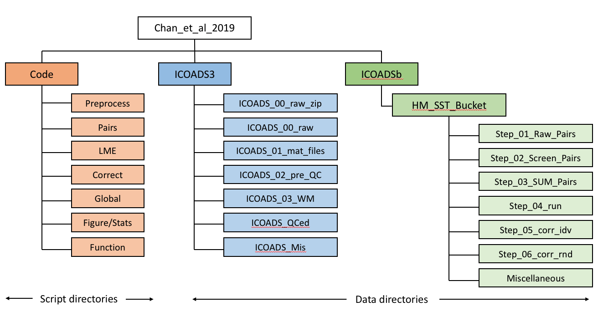

# Matlab scripts for groupwise bucket corrections in Chan et. al. 2019

## System requirements:

Below is the flow chart of our analysis.

Several steps in processing are memory and computationally intensive.  Our analysis was run on Harvard Research Computing clusters and uses 100 nodes and 150GB memory per node, and required 2,000 core-hours of computation and 70GB of disk space.  

For purposes of facilitating reproduction we have also provided files resulting from our computation at various stages of the analysis (indicated by red arrows).

Matlab [m_map](https://www.eoas.ubc.ca/~rich/map.html) toolbox is required, and its path should be specified in [HM_load_package.m](HM_load_package.m).

________________________________

## Get started:
Run [Chan_et_al_init.m](Chan_et_al_init.m) to initialize the analysis.  This script will add all scripts in this package to Matlab path and set up directories structured following the below figure.  The default path will be the directory of this package; so make sure that enough disk space is available (~70G), otherwise, specify another directory to store the data:

`Chan_et_al_init($home_data)`

________________________________

________________________________

## A. Preprocess:
This folder contains scripts for downloading and preprocessing the ICOADS3.0 data. ICOADS3.0 is 28GB and can be downloaded from [RDA dataset 548.0](https://rda.ucar.edu/datasets/ds548.0/#!description).  We have also archived a version [here]().  

This step takes X to run.  To run these scripts, before get started, please make sure the following metadata are downloaded from [here] and placed in `$home_ICOADS3/ICOADS_Mis/`

update [ICOADS_OI.m](Preprocess/__ICOADS_OI.m__) according to where the ICOADS3.0 dataset is stored (`$home_ICOADS`) and run `.m` to generate directories for raw and processed ICOADS3.0 dataset.

0. [ICOADS_Step_00_download.csh](Prerocess/ICOADS_Step_00_download.csh) downloads raw ICOADS3.0 data to folder `$Home_ICOADS3.0/ICOADS_00_raw_zip/` and [ICOADS_Step_00_unzip.sh](Preprocess/ICOADS_Step_00_unzip.sh) unzips the data files.  Unzipped files are stored in `$Home_ICOADS3.0/ICOADS_00_raw/`.

1. [ICOADS_Step_01_ascii2mat.m](Preprocess/ICOADS_Step_01_ascii2mat.m)  converts ICOADS data from ASCII file to .mat files and stores them in `$Home_ICOADS3.0/ICOADS_01_mat_files/`.

2. [ICOADS_Step_02_pre_QC.m](Preprocess/ICOADS_Step_02_pre_QC.m) assigns missing country information and measurement method and outputs files to
`$Home_ICOADS3.O/ICOADS_02_pre_QC/`

3. [ICOADS_Step_03_WM.m](Preprocess/ICOADS_Step_03_WM.m) generates winsorized mean of 5-day SST at 1 degree resolution.  These gridded data are stored in `$Home_ICOADS3.0/ICOADS_03_WM/`

4. [ICOADS_Step_04_Neighbor_std.m](Preprocess/ICOADS_Step_04_Neighbor_std.m) computes between neighbor standard deviation of SST for each month.

5. [ICOADS_Step_05_Buddy_check.m](Preprocess/ICOADS_Step_05_Buddy_check.m) performs buddy check and other quality controls.  Outputs are preprocessed files stored in `$Home_ICOADS3.0/ICOADS_QCed/`

Step 2 follows Chan et al., submitted, and steps 3-5 follow [Rayner et al. (2006)](https://journals.ametsoc.org/doi/full/10.1175/JCLI3637.1) in performing buddy check.  A [1982-2014 OI-SST daily climatology]() and [other metadata]() should be placed in `$home_ICOADS3.0/ICOADS_Mis/` to run these preprocessing scripts.

________________________________
## B. Main Code:

This step can be accessed directly without performing preprocessing by downloading the [preprocessed .mat files]() and place them in `$Home_ICOADS3.0/ICOADS_QCed/`.   [HM_OI.m](HM_OI.m) will need to be updated depending on where preprocessed ICOADS3.0 .mat files are hosted.  Please also specify home directory for data generated during the main analysis (`$home_LME`) and run `.m` to generate these directories.

1. __Pairs__ folder contains functions that first [pair SST measurements within 300km and 2days of one another](Pairs/HM_pair_01_Raw_Pairs_dup.m) and then [screens pairs such that each measurement is used at most once](Pairs/HM_pair_02_Screen_Pairs_dup.m) ([Chan and Huybers., 2019](https://journals.ametsoc.org/doi/pdf/10.1175/JCLI-D-18-0562.1)).  In the main folder, [HM_Step_01_Run_Pairs_dup.m](HM_Step_01_Run_Pairs_dup.m) is the script to run these functions.  In addition, diurnal cycle estimates based on ICOADS3.0 buoy data, [DA_SST_Gridded_BUOY_sum_from_grid.mat]() and [Diurnal_Shape_SST.mat](), should be placed in `$home_LME/Miscellaneous/` to run the pairing.  

  Output files are stored in `$home_LME/Step_01_Raw_Pairs/` and `$home_LME/Step_02_Screen_Pairs/`.  Run [HM_Step_02_SUM_Pairs_dup.m](HM_Step_02_SUM_Pairs_dup.m) to combine screened pairs from individual files into one file, which will be used in following steps.  The combined file, [SUM_HM_SST_Bucket_Screen_Pairs_*.mat](), should be placed in `$home_LME/Step_03_SUM_Pairs/`.

2. __LME__ folder contains scripts that compute offsets among groups of SST measurements using on a linear-mixed-effect model ([Chan and Huybers., 2019](https://journals.ametsoc.org/doi/pdf/10.1175/JCLI-D-18-0562.1)).  In the main folder, [HM_Step_03_LME_cor_err_dup.m](HM_Step_03_LME_cor_err_dup.m) is the script to perform the offset estimation.  Data generated in this step, including group-wise offset estimates - [LME_HM_SST_Bucket_yr_start_1850*.mat](),  will be saved in `$home_LME/Step_04_run/`.

3. __Correct__ folder contains scripts that apply groupwise corrections and generates gridded SST estimates.  Groupwise corrections are applied to each SST measurement by removing offset estimated in step __2__.  In the main folder, [HM_Step_04_Corr_Idv.m](HM_Step_04_Corr_Idv.m) is the script to perform corrections using the maximum likelihood estimates of offsets.  [This script](HM_Step_04_Corr_Idv.m) also generates gridded SST estimates that only correct for one group at a time.  Associated output files are in `$home_LME/Step_05_corr_idv/` and can be downloaded [here]().

  In the main folder, [HM_Step_05_Corr_Rnd.m](HM_Step_05_Corr_Rnd.m) generates a 1000-member ensemble of gridded SSTs to estimate uncertainties of groupwise corrections.  For each correction member, corrected offsets are drawn from a multivariate normal distribution centered on the maximum likelihood estimates (Appendix in [Chan and Huybers., 2019](https://journals.ametsoc.org/doi/pdf/10.1175/JCLI-D-18-0562.1)).   Associated output files are in `$home_LME/Step_06_corr_rnd/` and can be downloaded [here]().

  In the main folder, [HM_Step_06_SUM_Corr.m](HM_Step_06_SUM_Corr.m) computes statistics of corrected gridded SST estimates, e.g., trends from 1908-1941, average time series over NP and NA, and PDO indices.

Global: This folder contains scripts that merges global correction to raw ICOADS and ICOADS with only regional bucket corrections. Running GC_Step_01_SST_merge_GC_to_ICOADSb.m generates ICOADSa and ICOADSb. Another script GC_Step_02_add_GC_to_ICOADSa_statistics.m merges key statistics, including those from random ICOADSb members, to generate figures and tables.

Stats: Contains a set of scripts that generate statistics reported in the texts as well as some tables. It is better to run these lines before generating tables and figures.

Figure: Contains scripts to plot figure in the main text. We have placed functions starting with CDC_ or CDF_ in the External folder. They are scripts required to generate figures.

________________________________

Data and metadata

Because pre-processing ICOADS take substantial amount of time to run, and also to guarantee the full reproduction of our results, we provide pre-processed ICOADS 3.0 dataset we used in .mat format (). You can choose to start from here, which is step 2, pairing of SSTs.

However, the whole pairing step is also time consuming, and we provide sum of all pairs with setup used in the main text in the following file, which can be found in the Data folder.

SUM_HM_SST_Bucket_Screen_Pairs_c_once_1850_2014_NpD_1_rmdup_0_rmsml_0_fewer_first_0.mat

We also provide the following data as check point of the whole analysis, which can all be found in the Data folder.

Binned pairs:

BINNED_HM_SST_Bucket_yr_start_1850_deck_level_1_cor_err_rmdup_0_rmsml_0_fewer_first_0_correct_kobe_0_connect_kobe_1.mat

LME results:

LME_HM_SST_Bucket_yr_start_1850_deck_level_1_cor_err_rmdup_0_rmsml_0_fewer_first_0_correct_kobe_0_connect_kobe_1.mat

ICOADSa and ICOADSb:

ICOADS_a_b.mat

Statistics reported:

SUM_corr_idv_HM_SST_Bucket_deck_level_1_GC_do_rmdup_0_correct_kobe_0_connect_kobe_1_yr_start_1850.mat

Statistics based on 1,000 correction members:

SUM_corr_rnd_HM_SST_Bucket_deck_level_1_GC_do_rmdup_0_correct_kobe_0_connect_kobe_1_yr_start_1850.mat

Statistics for bucket records:

Stats_HM_SST_Bucket_deck_level_1.mat

Assess to individual regional correction members are available upon request.

Metadata is required to run the whole analysis. These files are placed in folder Metadata. Please make sure to put them in the right directory such that HM_OI.m and ICOADS_OI.m, two output/input controlling functions, can find these files.
